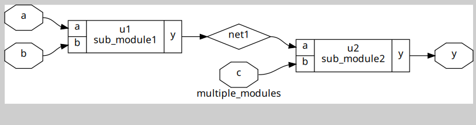
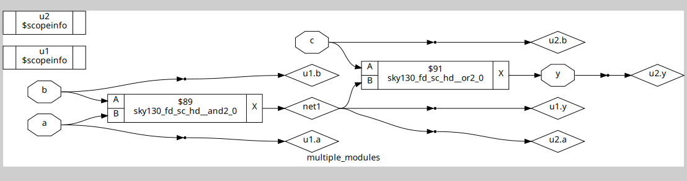
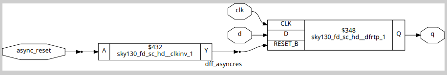
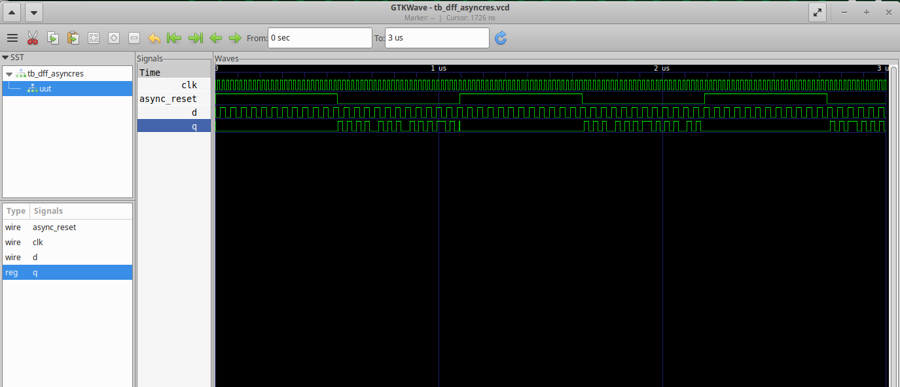
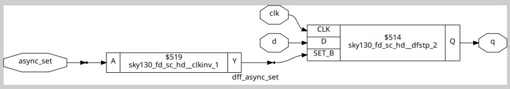
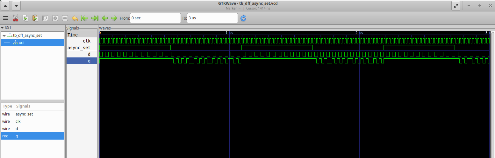
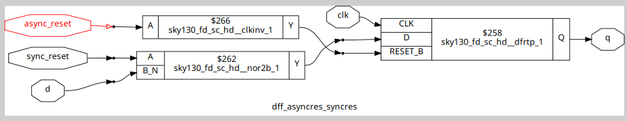
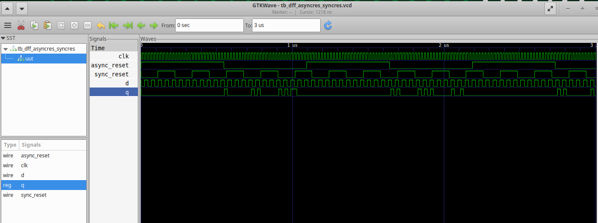

# Labs

## Hierarchial Synthesis

### multiple_modules.v hierarchial synthesis

### multiple_modules.v flat synthesis

## Flop Coding Styles

### Synthesis of DFF with Async Reset

### Simulation of DFF with Async Reset

### Synthesis of DFF with Async Set

### Simulation of DFF with Async Set

### Synthesis of DFF with Async Reset and Sync Set

### Simulation of DFF with Async Reset and Sync Set

