# Synthesis Optimisations

## Combinational Logic Optimisations

### Synthesis of opt_check
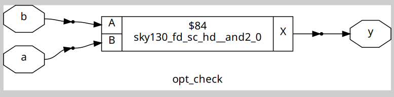

### Synthesis of opt_check2
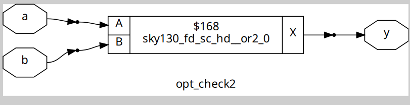

### Synthesis of opt_check3
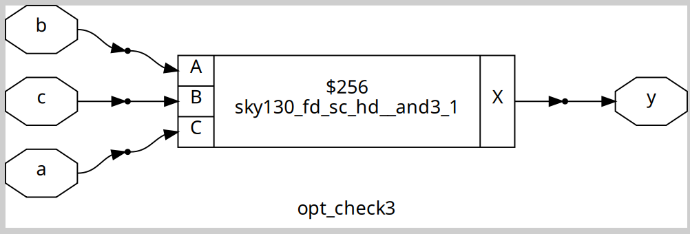

### Synthesis of opt_check4
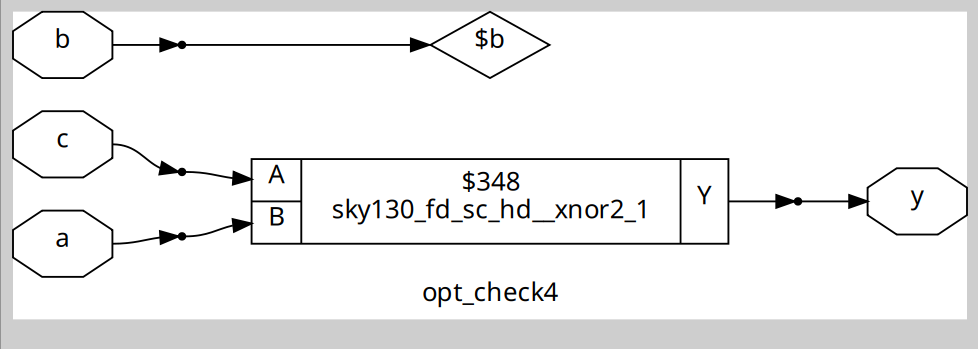

## Sequential Logic Optimisations

### Synthesis of dff_const1
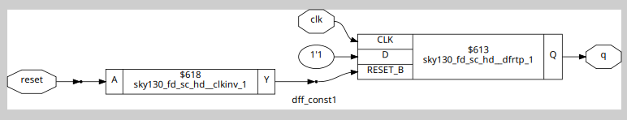

### Synthesis of dff_const2
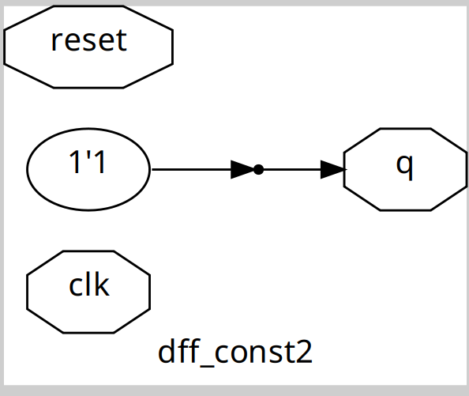

### Synthesis of dff_const3

### Synthesis of dff_const4
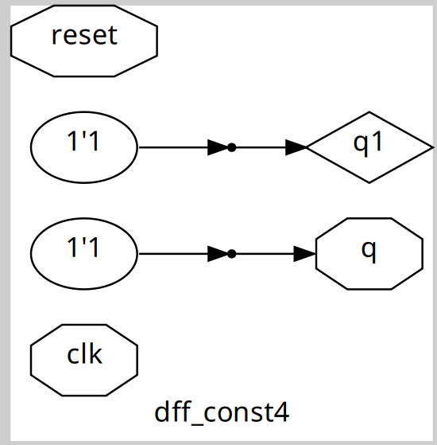

### Synthesis of dff_const5
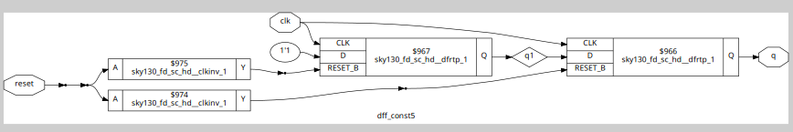

## Unused Output Logic Optimisations

### Synthesis of counter_opt
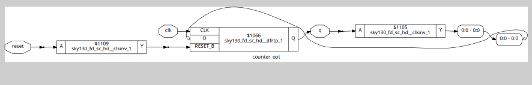

### Synthesis of counter_opt2
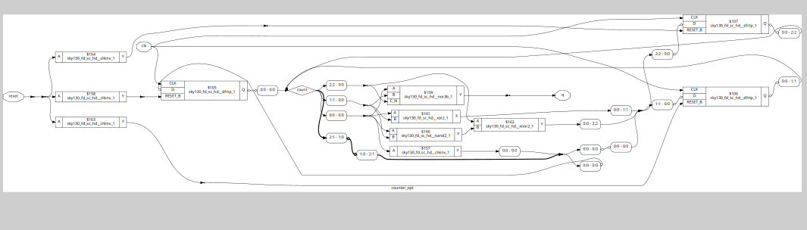

## Additional Exercise

### Synthesis of multiple_module_opt
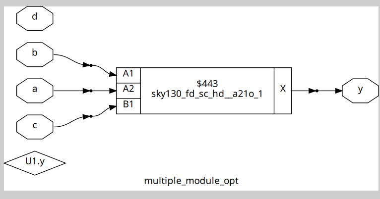

### Synthesis of multiple_module_opt2
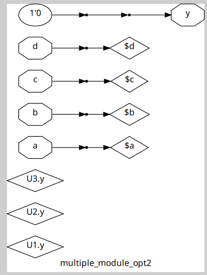

