# Gate Level Simulation and Mismatches

## Synthesis Simulation Mismatch

### Functional Simulation ternary_operator_mux
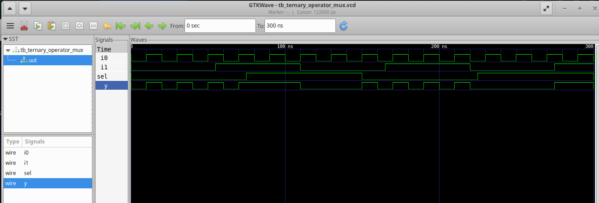

### Synthesis ternary_operator_mux  
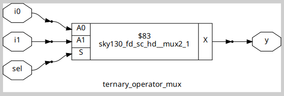

### Gate Level Simulation ternary_operator_mux
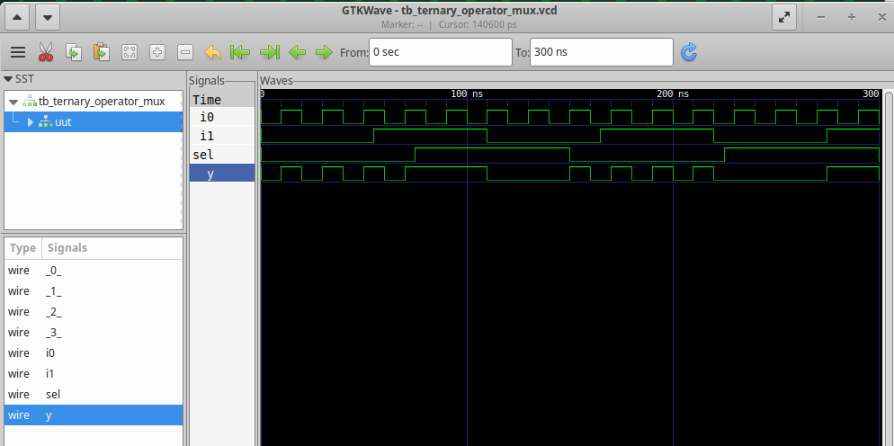

### Functional Simulation good_mux
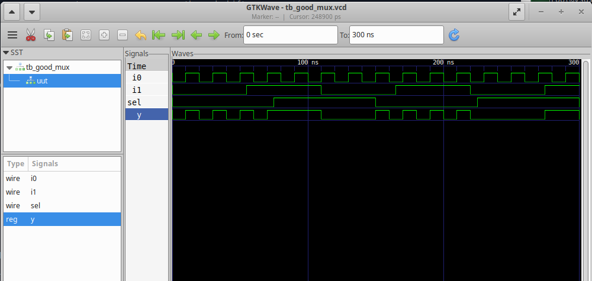

### Synthesis good_mux
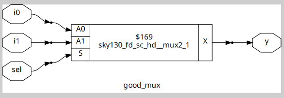

### Gate Level Simulation good_mux
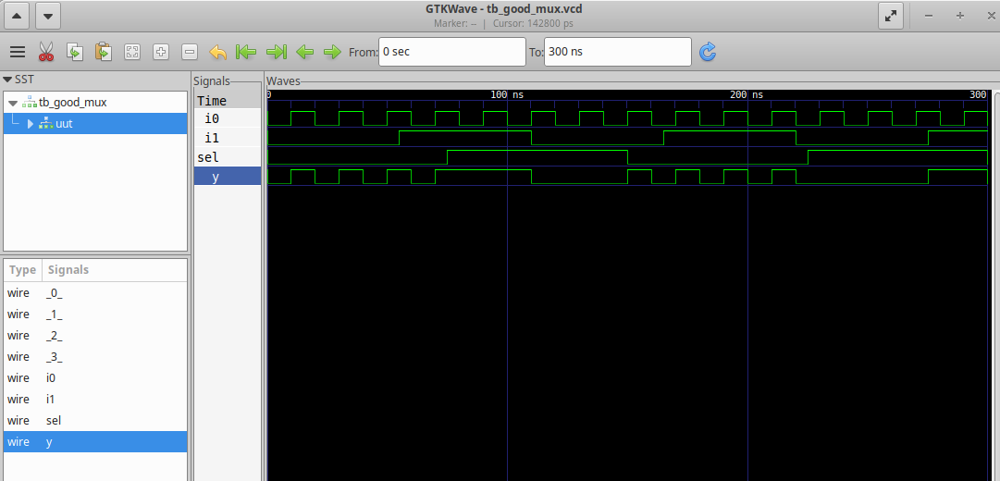

### Functional Simulation bad_mux
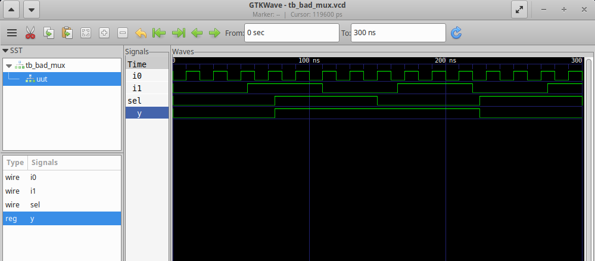

### Synthesis bad_mux
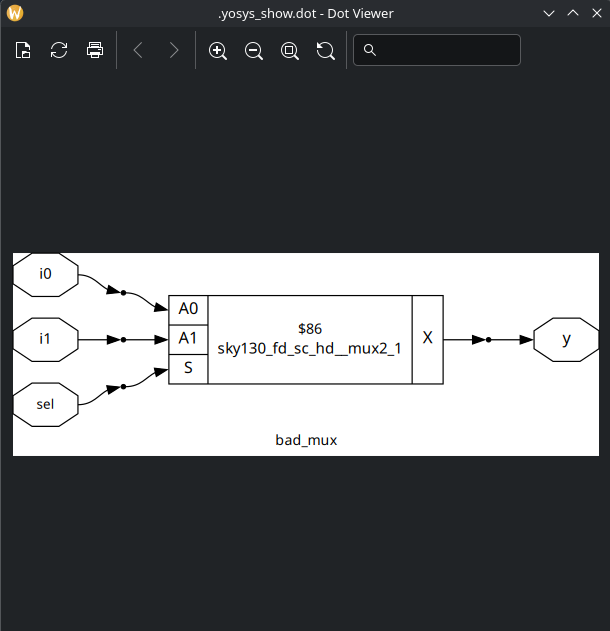

### Gate Level Simulation bad_mux
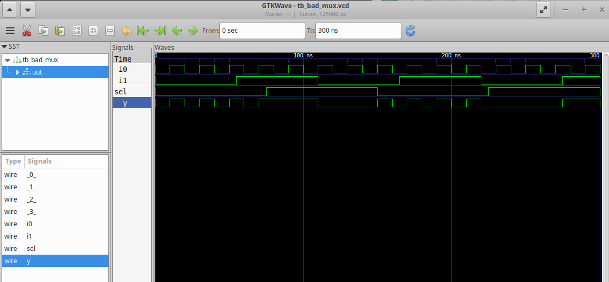

### Functional Simulation blocking_caveat
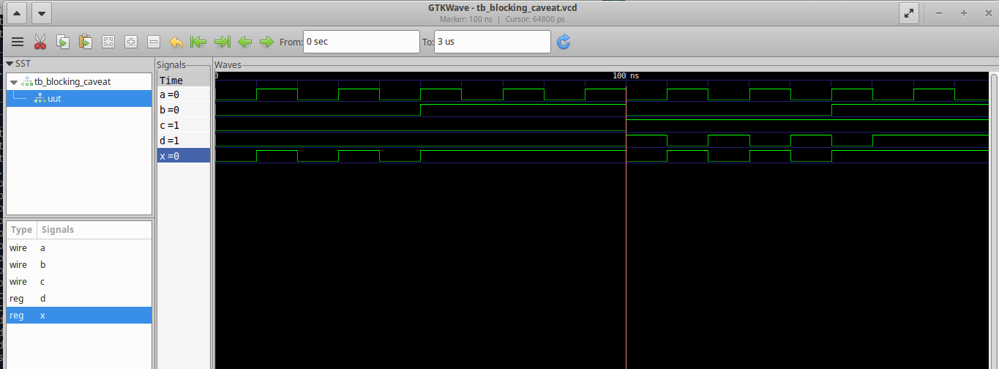

### Synthesis blocking_caveat
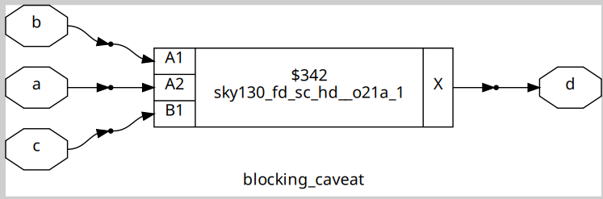

### Gate Level Simulation blocking_caveat
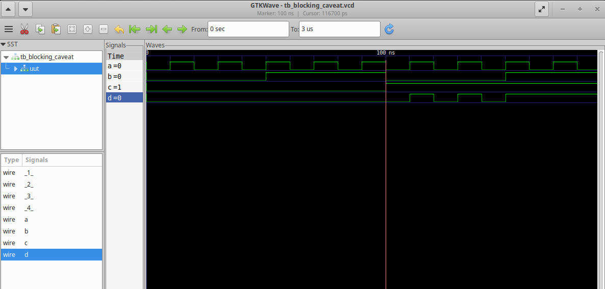